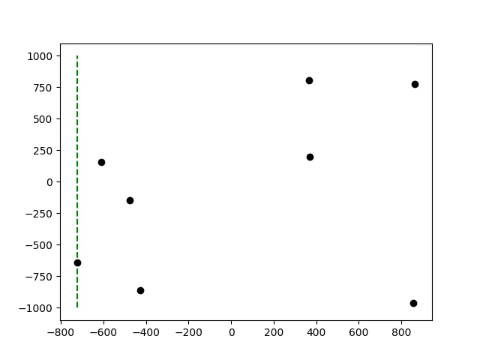
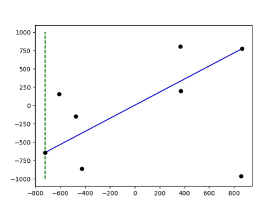
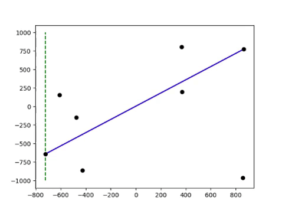

# convex-hull

The idea behind [Andrew's monotone](https://en.wikipedia.org/wiki/Convex_hull_algorithms) chain algorithm for constructing convex hulls in the plane is simple and intuitive.

Points are sorted lexicographically (first by x-coordinate, and in case of a tie, by y-coordinate). Then, by sweeping across the sorted points, the upper and lower hull sections are constructed, and finally merged.

The description leaves some room for interpretation, which leads to different implementations (with different performances).

## Public implementation

A [publicly available implementation](https://en.wikibooks.org/wiki/Algorithm_Implementation/Geometry/Convex_hull/Monotone_chain) constructs the hull sections independently, one ofter the other.

## Andrew's proposition

Iterating over the points twice might seem wasteful and unnecessary. It can be easily solved by drawing a line through the first and last endpoint (which are part of both sections) and use it decide, for every point, to which hull section it can belong.

In fact, the author of the algorithm never proposed the double loop, but went along the above intuition in [his article](https://doi.org/10.1016/0020-0190(79)90072-3).

## Optimised implementation

The idea can be taken further by consistently updating the line, which determines, where the points can be considered. The lines are in fact two, and they appear to expand the convex hull on each iteration, until its final form is reached.

## Performance

Implementations were tested on uniformly sampled points. In the image below, only the linear part (without preprocessing or sorting) is shown. As expected, Andrew's proposition performs about twice as fast as the public implementation. The optimised version performs even better, since all irrelevant points are ignored.

.")

### Point distribution and preprocessing

The point cloud can be preprocessed (by finding the furthermost points in `x` and `y` directions, a quadrilateral is constructed, within which no points can be part of the final hull).

For a point cloud sampled from a triangular distribution, this works well enough (results include sorting and preprocessing):

.")

In the case of uniformly sampled points, however, not enough points are removed, for the process to be worth the additional effort:

.")

In both cases, the optimised version is faster than all the rest. For `n <= 1000000`, preprocessing only seemed to hamper it.
